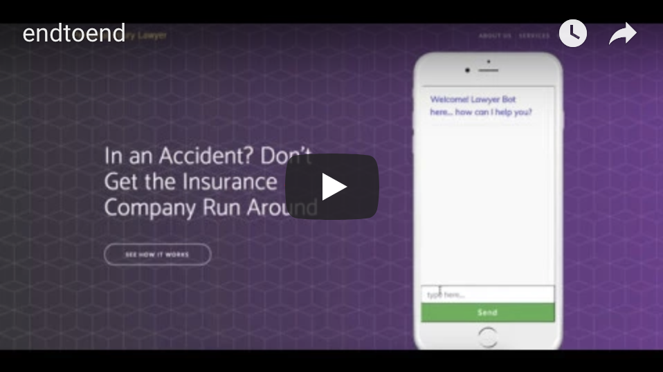
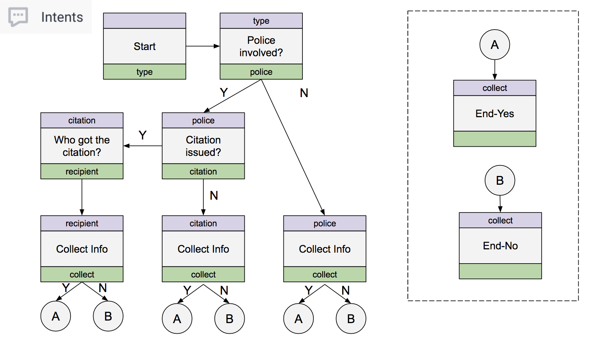

# Lawyer Bot

Lawyer Bot is a suite of applications, containing an AI Chatbot designed to keep website visitors engaged in an automated conversation. The goal of the AI Chatbot is to increase the probability of conversion from inquiry to lead generation.

It is built for [Sting Marketing](http://sting.net) as a Minimum Viable Product (MVP) in order to validate the ability of conversational user experience platforms (such as Dialogflow) to engage users. The AI Chatbot engages website visitors in an automated conversation and capture data from the conversation as parameters.

## About this project

Lawyer Bot is built as a capstone project for [Galvanize](https://www.galvanize.com/phoenix/campus).

Time Constraints:
* This project has to be completed in less than 2 weeks

My role in this project:
* I am the sole developer for this project

## How it works

In order to best demonstrate Lawyer Bot, I'd like to introduce a scenario of a Personal Injury Law Firm with 2 roles:
* Potential Customer
* Personal Injury Lawyer


Lisa (the Potential Customer) will be interacting with Lawyer Bot either through the Personal Injury Website or any Google Assistant enabled devices (e.g., App on iOS/Android, Google Home).

John (the Personal Injury Lawyer) at the back office will be managing incoming leads through either the CRM Lite Dashboard or CRM Xtra Lite mobile app.


You can view the demo recording below.

[](https://www.youtube.com/watch?v=azRjJF9_QYo)

## Architecture

In our Personal Injury Firm scenario, if Lisa the potential customer decides to provide her information (name, phone, email) during the conversation with the Chatbot, the data captured will be stored in the database. This is done through the REST API calls.

Once the customer's information is stored in the database, the lawyer can access and work with the information from either Dashboard or Mobile app.

Authentication on the Dashboard is implemented by utilizing Firebase and the automated conversation is designed using Dialogflow.


Lawyer Bot consists of 4 components
* REST API
  * [https://github.com/lukitos/lawyerbot-api](https://github.com/lukitos/lawyerbot-api)
* AI Chatbot
  * [https://github.com/lukitos/lawyerbot-aichat](https://github.com/lukitos/lawyerbot-aichat)
* Lawyer Dashboard for CRM Lite
  * [https://github.com/lukitos/lawyerbot-crm-dashboard](https://github.com/lukitos/lawyerbot-crm-dashboard)
* Lawyer Mobile app for CRM Extra Lite
  * [https://github.com/lukitos/lawyerbot-crm-mobile](https://github.com/lukitos/lawyerbot-crm-mobile)

`Note: URL to deployed apps are available upon request. Please email me at lukitos200@gmail.com to request for access.`

And below are the technologies utilized to build Lawyer Bot's suite of applications.


#### REST API
* Node.js
* Express
* PostgreSQL

#### AI Chatbot
* Dialogflow
* Socket.IO
* Bootstrap

```
Note: API.AI has been recently renamed to Dialogflow
```

#### Dashboard
* React/Redux
* Firebase (authentication)
* Bootstrap
* Chart.js

#### Mobile application
* React Native

#### Technology Decisions


### Conversation Flow Design

The diagram below is a graphical representation of Intents built in Dialogflow. Each intent is represented by a box in the diagram.

The purple section on top of each intent box is input context and the green section on the bottom of each intent box is the output context.



## License
MIT
