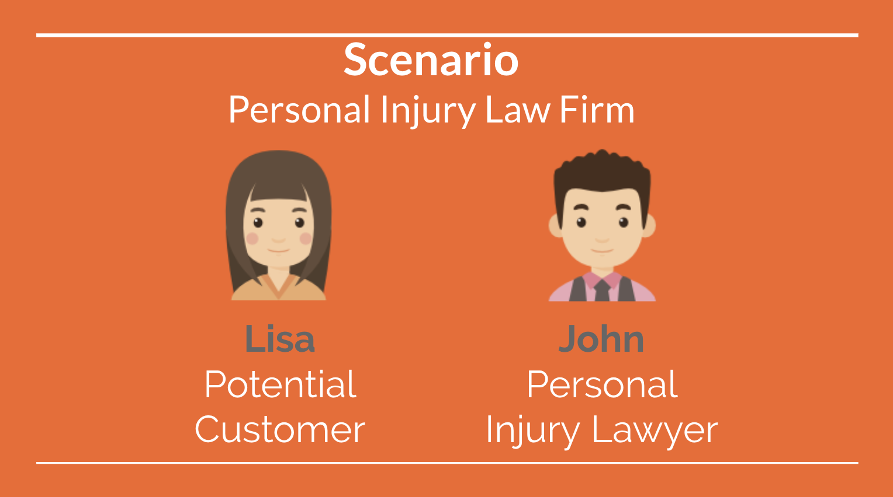
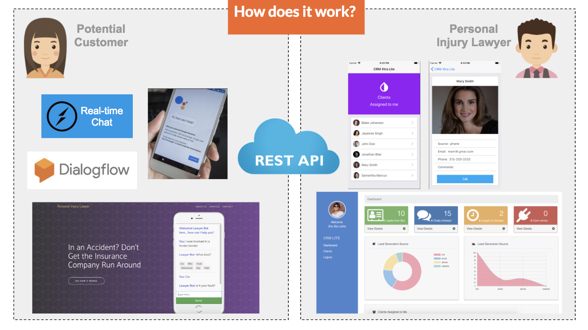
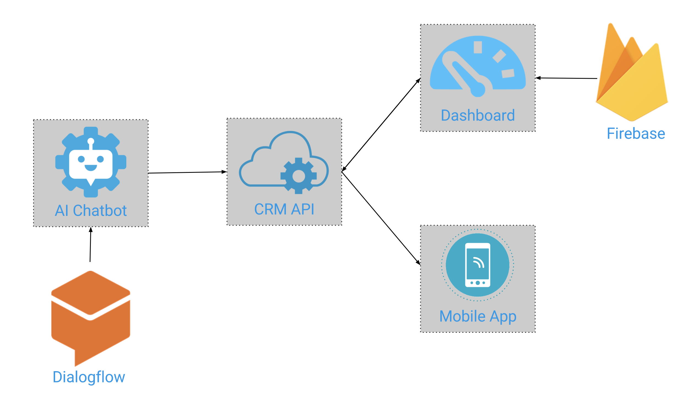
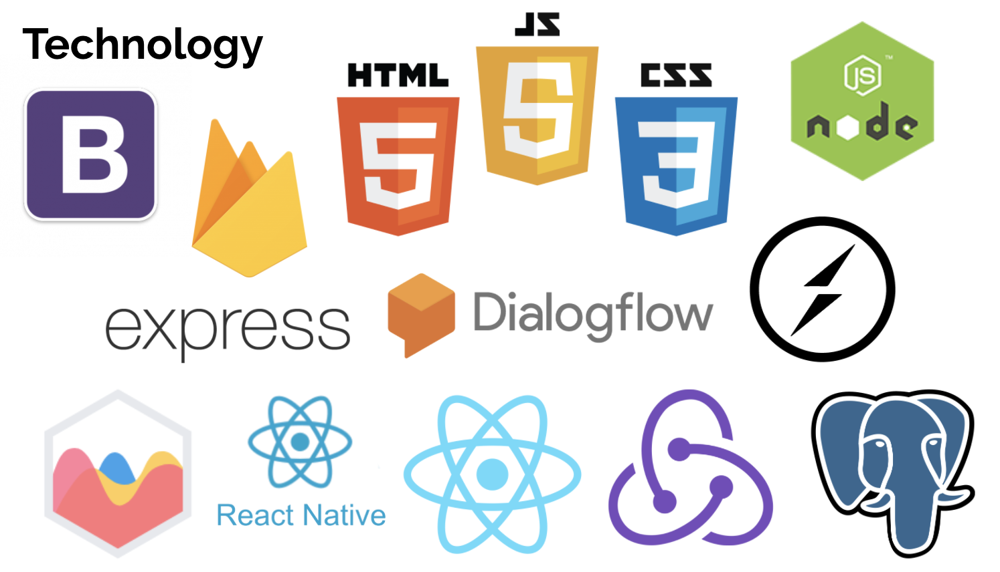

# Lawyer Bot

Lawyer Bot is an AI Chatbot designed to keep website visitors engaged in an automated conversation with the goal of increasing the probability for conversion from inquiry to lead generation.

It is built for [Sting Marketing](http://sting.net) as a Minimum Viable Product (MVP) in order to validate the ability for conversational user experience platform (such as Dialogflow) to engage website visitors in an automated conversation and capture data from the conversation.

## How it works

In order to best demonstrate Lawyer Bot, I'd like to introduce a scenario of a Personal Injury Law Firm with 2 roles:
* Potential Customer
* Personal Injury Lawyer



Lisa (the Potential Customer) will be interacting with Lawyer Bot either through the Personal Injury Website or any Google Assistant enabled devices (e.g., App on iOS/Android, Google Home).

John (the Personal Injury Lawyer) at the back office will be managing incoming leads through either the CRM Lite Dashboard or CRM Xtra Lite mobile app.




## Architecture



Lawyer Bot consists of 4 components
* REST API
  * [https://github.com/lukitos/lawyerbot-api](https://github.com/lukitos/lawyerbot-api)
  * [http://13.59.231.79:8000/api/contact](http://13.59.231.79:8000/api/contact)
* AI Chatbot
  * [https://github.com/lukitos/lawyerbot-aichat](https://github.com/lukitos/lawyerbot-aichat)
  * [http://18.221.134.160:4000/](http://18.221.134.160:4000/)
* Lawyer Dashboard for CRM Lite
  * [https://github.com/lukitos/lawyerbot-crm-dashboard](https://github.com/lukitos/lawyerbot-crm-dashboard)
  * [http://capstonelawyerbot.s3-website.us-east-2.amazonaws.com/](http://capstonelawyerbot.s3-website.us-east-2.amazonaws.com/)
* Lawyer Mobile app for CRM Extra Lite
  * [https://github.com/lukitos/lawyerbot-crm-mobile](https://github.com/lukitos/lawyerbot-crm-mobile)

And below are the technologies utilized to build Lawyer Bot's suite of applications.



#### REST API
* Node.js
* Express
* PostgreSQL

#### AI Chatbot
* Dialogflow
* Socket.IO
* Bootstrap

```
Note: API.AI has been recently renamed to Dialogflow
```

#### Dashboard
* React/Redux
* Firebase (authentication)
* Bootstrap
* Chart.js

#### Mobile app
* React Native
